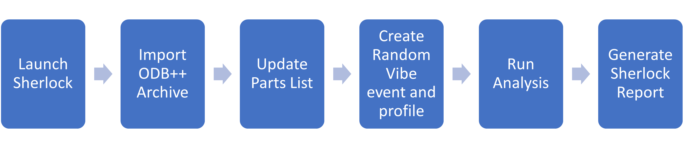

==========
User guide
==========
This section provides an overview of PySherlock and explains how to use it.

Prerequisites
-------------
For installation instructions and information on launching Sherlock and the gRPC server,
see :ref:`ref_getting_started`. The Sherlock gRPC server must be running to use PySherlock.

PySherlock services
-------------------
PySherlock methods are divided into modules that correspond to major Sherlock functional areas.
For descriptions of each module's classes, methods, and functions, see :ref:`ref_api_ref`.

Using PySherlock
----------------
After the Sherlock gRPC server is started, you can use PySherlock methods to perform Sherlock
client operations.

Subsequent topics describe how to use PySherlock to automate the process depicted in this diagram:

.. This workflow demonstrates how to launch Sherlock, import an ODB++ archive to create a
.. project, update the parts list, create a random vibe event and profile, run a random vibe analysis,
.. and generate a project report.

Launch Sherlock
~~~~~~~~~~~~~~~
Use the :func:`ansys.sherlock.core.launcher.launch_sherlock`
method to launch Sherlock and start the gRPC server on the default port:

.. code::

    from ansys.sherlock.core.launcher import launch_sherlock
    sherlock = launch_sherlock()

This method returns the ``sherlock`` gRPC connection object, which is used to invoke
the APIs from their respective services.

Import ODB++ archive
~~~~~~~~~~~~~~~~~~~~
Use the :func:`ansys.sherlock.core.project.Project.import_odb_archive`
method to import the ODB++ archive file (``ODB++ Tutorial.tgz``). This code imports the
archive file and creates a project named ``Tutorial`` with a CCA named ``Main Board``.

.. code::

    sherlock.project.import_odb_archive(
            "C:\\Temp\\ODB++ Tutorial.tgz",
            True,
            True,
            True,
            True,
            project="Tutorial",
            cca_name="Main Board"
    )

For information on the ``project`` module and its methods, see :ref:`ref_project_module`.

Update parts list
~~~~~~~~~~~~~~~~~
Use the :func:`ansys.sherlock.core.parts.Parts.update_parts_list` method to update the
parts list for the previously created CCA ``Main Board``. This code uses the Sherlock Part Library
to update the parts list:

.. code::

    sherlock.parts.update_parts_list(
            "Tutorial",
            "Main Board",
            "Sherlock Part Library",
            "Both",
            "Error"
    )

For information on the ``parts`` module and its methods, see :ref:`ref_parts_module`.

Add random vibe event
~~~~~~~~~~~~~~~~~~~~~
Use the :func:`ansys.sherlock.core.lifecycle.Lifecycle.add_random_vibe_event` method
to add a random vibe event:

.. code::

    sherlock.lifecycle.add_random_vibe_event(
            "Tutorial",
            "Phase 1",
            "RVEvent 1",
            100,
            "ms",
            0.5,
            "PER MIN",
            "0,0",
            "Uniaxial",
            "0,0,-1"
    )

For information on the ``lifecycle`` module and its methods, see :ref:`ref_lifecycle_module`.

Add random vibe profile
~~~~~~~~~~~~~~~~~~~~~~~
Use the :func:`ansys.sherlock.core.lifecycle.Lifecycle.add_random_vibe_profiles` method to
add a random vibe profile:

.. code::

    sherlock.lifecycle.add_random_vibe_profile(
            "Tutorial",
            "Phase 1",
            "RVEvent 1",
            "Profile 1",
            "HZ",
            "G2/Hz",
            [(30.4, 7.61e-5), (204, 0.1), (296, 0.06), (385, 0.06), (454, 0.03), (497, 0.06)]
    )

For information on the ``lifecycle`` module and its methods, see :ref:`ref_lifecycle_module`.

Run analysis
~~~~~~~~~~~~~
Use the :func:`ansys.sherlock.core.analysis.Analysis.run_analysis` method to run a random
vibe analysis:

.. code::

    sherlock.analysis.run_analysis(
            "Tutorial",
            "Main Board",
            [
                ("RANDOMVIBE",
                [
                    ("Phase 1", ["RVEvent 1"])
                ]
                )
            ]
    )

For information on the ``analysis`` module and its methods, see :ref:`ref_analysis_module`.

Generate Sherlock report
~~~~~~~~~~~~~~~~~~~~~~~~
Use the :func:`ansys.sherlock.core.project.Project.generate_project_report` method to
generate a Sherlock report for the project ``Tutorial`` and save it to a PDF file
in ``C:\Temp\tutorial_project_report.pdf``:

.. code::

    sherlock.project.generate_project_report(
            "Tutorial",
            "User Name",
            "Ansys, Inc",
            "C:\\Temp\\tutorial_project_report.pdf"
    )

For information on the ``project`` module and its methods, see :ref:`ref_project_module`.
